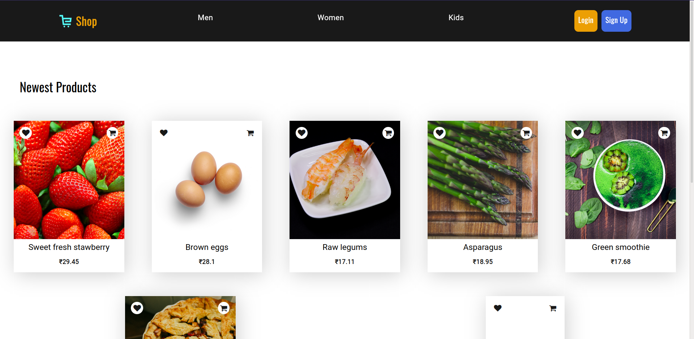

# ✨ hacktoberfest2022 💫


## 🌱 Contributing to hacktoberfest 2022

### Welcome to hacktoberfest 2022 Public Repository. 👨🏻‍💻

<p>A month-long celebration from October 1st - 31st sponsored by Digital Ocean and GitHub to get people involved in Open Source. Create your very first pull request to any public repository on GitHub and contribute to the open source developer community.

https://hacktoberfest.digitalocean.com/</p>

---

### Process are as follows :-

-   Login using github @ [Hacktoberfest](https://hacktoberfest.digitalocean.com/)
-   Create four valid pull requests (PRs) between 1st - 31st October

---

### How to Contribute to this repository

-   Fork the repository (Click the Fork button in the top right of this page, click your Profile Image)
-   Clone the forked repository to your local machine.

```markdown
git clone https://github.com/your-username/E-store.git
```

-   change the present working directory

```markdown
cd E-store
```

-   Add/Create your project to the specific folder as described in what you can contribute section.
-   Make a new branch

```markdown
git checkout -b branch-name
```

-   Make change in the repository with the new branch.
-   push the changes.

```markdown
git add .
git commit -m "Your commit Message"
git push origin branch-name
```

-   Make a pull request.
-   Star the repository.

### NOTE

-   Make Sure you commit your changes in a new branch.
-   Make Sure you Give proper name to your files describing the addition.
-   Also Make Sure you comment your code whereever necessary.

# E-Store

[Visit E-Store on Heroku](https://estore24.herokuapp.com/)

## Table of contents

-   [E-Store](#e-store)
    -   [Table of contents](#table-of-contents)
    -   [Introduction](#introduction)
    -   [Demo](#demo)
    -   [Technology](#technology)
    -   [Features](#features)
    -   [Database](#database)
        -   [User Schema:](#user-schema)
        -   [Product Schema:](#product-schema)
        -   [Order Schema:](#order-schema)
    -   [Colors](#colors)
    -   [Run](#run)
    -   [Todo](#todo)
        -   [Front End](#front-end)
        -   [Back End](#back-end)

## Introduction

A virtual ecommerce website using Node js, Express js, and Mongoose.

## Demo



The application is deployed to Heroku and can be accessed through the following link:

[E-Store on Heroku](https://estore24.herokuapp.com/)

The website resembles a real store and you can add products to your cart and pay for them. If you want to try the application with all features request me for admin creds.

## Technology

The application is built with:

-   Node.js version 15.13.0
-   MongoDB version 4.4.5
-   Express version 4.17.1
-   EJS version 3.1.6
-   Bootstrap version 4.4.1
-   FontAwesome version 4.7.0
-   AdminBro: used and customized to implement the admin panel
-   Passport: used for authentication

## Features

The application displays a virtual bags store that contains virtual products and contact information.

Users can do the following:

-   Create an account, login or logout
-   Browse available products added by the admin
-   Add Star reviews to products
-   Check other users review on every product.
-   Add products to the shopping cart
-   Delete products from the shopping cart
-   Display the shopping cart
-   A user must be logged in to review or add to cart etc...
-   Checkout information is processed using stripe and the payment is send to the admin
-   The profile contains all the orders a user has made
-   Payment integration with payu
-   Images upload with multer and cloudinary

Admins can do the following:

-   Login or logout to the admin panel
-   View all the information stored in the database. They can view/add/edit/delete orders, users, products, reviews and categories. The cart model cannot be modified by an admin because a cart is either modified by the logged in user before the purchase or deleted after the purchase.

## Database

All the models can be found in the models directory created using mongoose.

### User Schema:

-   username (String)
-   title (String)
-   password (String)
-   googleId (String)
-   Cart [ObjectId - a reference to the products schema]

### Product Schema:

-   title (String)
-   image (String)
-   description (String)
-   price (Number)

### Order Schema:

-   user (ObjectId - a reference to the user schema)
-   txnId (String)
-   createdAt (Date)
-   Delivered (Boolean)

## Colors

Below is the color palette used in this application:

-    `#ec9f05`
-    `#4169e1`
-    `#181818`

## Run

To run this application, you have to set your own environmental variables. For security reasons, some variables have been hidden from view and used as environmental variables with the help of dotenv package. Below are the variables that you need to set in order to run the application:

-   MONGO_URI: this is the connection string of your MongoDB Atlas database.

-   SESSION_SECRET: a secret message for the session. You can use any string here.

-   GOOGLE_CLIENTID : Your google google oauth client ID.

-   GOOGLE_CLIENTSECRET : Your google google oauth client SECRET.

After you've set these environmental variables in the .env file at the root of the project, you need to uncomment seedDB line to fill your empty MongoDB Atlas database. After that comment it again.

Now you can run "npm start" in the terminal and the application should work.

## Todo

#### Front End

-   [x] Mobile styling
-   [ ] Home page
-   [ ] filters
-   [ ] about us page
-   [ ] favicon
-   [ ] adjust product card

#### Back End

-   [ ] Search
-   [x] Categories
-   [x] payment integration
-   [ ] wishlist
-   [ ] security checks
-   [ ] strong validation login form and reviews
-   [x] 404 pages
-   [x] images upload
-   [ ] review images upload
-   [ ] quantity
-   [ ] forgot password
-   [ ] Delete User / reviews
